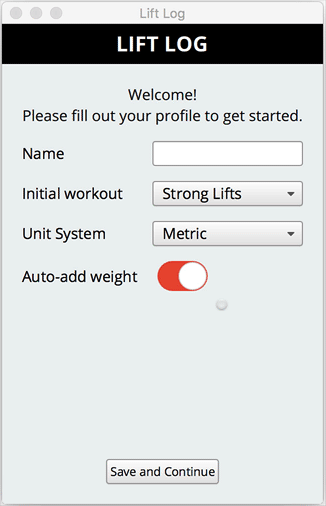

Lift Log
======

A mobile application written in C++, Qt and QML, that logs exercise activities done at a gym.

The application is still a Work in Progress.

Here is a screen cast of the existing functionality:

Originally written with Qt 5.4, the code has been updated to work with Qt 5.15.13. The app uses certain C++11 features, and Qt Quick Controls 1 (not 2).

Originally tested on macOS 10.10-ish, iOS 6-ish, Android 4-ish. More recently tested on macOS 10.12. In principle should work on Linux and Windows as well.

Code licensed under AGPLv3. Assets have their own licenses.
